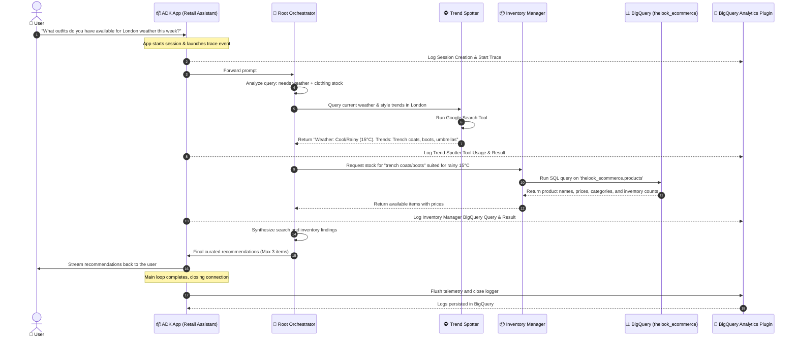

# 🔍 Agent Observability & Multi-Agent Retail Assistant with ADK

[](https://github.com/google/adk)
[](https://cloud.google.com/bigquery)
[](https://deepmind.google/technologies/gemini/)

This repository showcases a multi-agent system built using the **Google Agent Development Kit (ADK)** combined with **Agent Observability** powered by the **BigQuery Agent Analytics Plugin**.

Through this project, you will learn how to:
1. Orchestrate a **multi-agent hierarchy** using a Root Orchestrator and specialized sub-agents.
2. Integrate powerful toolsets: **Google Search** for real-time research and the **BigQuery Toolset** for querying massive enterprise databases (using the public `thelook_ecommerce` dataset).
3. Capture deep, comprehensive, and real-time **conversation traces and analytics** directly in BigQuery to evaluate tool usage, response flows, and system performance.

---

## 🏗️ System Architecture

The following diagram illustrates how the agents, tools, and observability components interact inside the application:

```mermaid
graph TD
    %% Define Nodes
    User([👤 User])
    App["📦 ADK App <br> (retail_assistant_agent)"]
    RootAgent["🤖 Root Orchestrator <br> (retail_assistant)"]
    
    subgraph Agents ["Specialized Sub-Agents"]
        RealTimeAgent["🕵️ Trend Spotter <br> (real_time_agent)"]
        InventoryAgent["📦 Inventory Manager <br> (inventory_data_agent)"]
    end

    subgraph ExternalServices ["External Services & Data"]
        GoogleSearch["🔍 Google Search API"]
        BQDataset[("📊 BigQuery Public Data <br> (thelook_ecommerce)"]
    end

    subgraph Observability ["Observability Pipeline"]
        BQPlugin["🔌 BigQueryAgentAnalyticsPlugin"]
        BQLogs[("📂 BigQuery Log Table <br> (adk_logs.retail_assistant_agent_logs)")]
    end

    %% Define Connections
    User -->|Sends prompt / Receives stream| App
    App -->|Manages Session & Executes| RootAgent
    
    RootAgent -->|Delegates style/weather research| RealTimeAgent
    RootAgent -->|Delegates stock checks| InventoryAgent
    
    RealTimeAgent -->|Invokes tool| GoogleSearch
    InventoryAgent -->|Executes query| BQDataset
    
    App -->|Intercepts events & Streams telemetry| BQPlugin
    BQPlugin -->|Writes trace logs| BQLogs

    %% Styling
    style User fill:#ececff,stroke:#9370db,stroke-width:2px;
    style App fill:#f9f9f9,stroke:#333,stroke-dasharray: 5 5;
    style RootAgent fill:#e1f5fe,stroke:#0288d1,stroke-width:2px;
    style RealTimeAgent fill:#ede7f6,stroke:#5e35b1,stroke-width:2px;
    style InventoryAgent fill:#ede7f6,stroke:#5e35b1,stroke-width:2px;
    style GoogleSearch fill:#fff3e0,stroke:#f57c00,stroke-width:1px;
    style BQDataset fill:#ffe0b2,stroke:#f57c00,stroke-width:2px;
    style BQPlugin fill:#e8f5e9,stroke:#388e3c,stroke-width:2px;
    style BQLogs fill:#c8e6c9,stroke:#388e3c,stroke-width:2px;
```

---

## 🔄 End-to-End Workflow Execution

When a user asks a complex question like: *"What outfits do you have available that are suitable for the weather in London this week?"*, the ADK framework handles the execution flow sequentially as detailed below:



---

## 🤖 Agent Roles & Specifications

The multi-agent setup consists of three agents, each having targeted roles, tools, and distinct instructions:

| Agent Name | Technical ID | Model | Description | Tools | Key Instruction |
| :--- | :--- | :--- | :--- | :--- | :--- |
| **Root Orchestrator** | `retail_assistant` | `gemini-2.5-flash` | Primary coordinator responsible for receiving user input, delegating tasks to sub-agents, and compiling/synthesizing the final recommendation. | `real_time_agent` (via `AgentTool`) | Combine weather/style insights from `real_time_agent` and stock results from `inventory_data_agent` to recommend exactly 3 items. |
| **Trend Spotter** | `real_time_agent` | `gemini-2.5-flash` | Real-time research agent that monitors external circumstances, local seasons, weather, and current styles. | `google_search` | Use Google Search to find current weather in locations and recommend fitting clothing styles. |
| **Inventory Manager** | `inventory_data_agent` | `gemini-2.5-flash` | Data-driven agent managing product catalogs, checking availability, and retrieving accurate pricing in the database. | `BigQueryToolset` | Query `bigquery-public-data.thelook_ecommerce` products table using the given Cloud Project ID. |

---

## 📈 Agent Observability with BigQuery

A core highlight of this project is demonstrating **enterprise-grade observability** using ADK plugins.

```python
bq_logger_plugin = BigQueryAgentAnalyticsPlugin(
    project_id=PROJECT_ID, 
    dataset_id=DATASET_ID, 
    table_id=TABLE_ID
)
app = App(name=APP_NAME, root_agent=root_agent, plugins=[bq_logger_plugin])
```

### What is captured?
The `BigQueryAgentAnalyticsPlugin` hooks into the ADK event loop, capturing and logging critical metadata to your specified table:
- **Session Details:** User ID, Session ID, Timestamp.
- **Agent Executions:** Exact instruction, prompt, models used, and latency metrics.
- **Tool Trace:** Every search query run, SQL query executed against BigQuery, and the raw responses returned.
- **Sub-Agent Delegation:** Visualizing how the orchestrator transfers tasks and what prompts are used between agents.
- **Errors & Statuses:** Graceful failure capture and trace tracking.

With this structured log dataset, developers can build **Looker Studio Dashboards** to monitor agent performance, detect slow tool executions, analyze standard user pathways, and optimize the multi-agent system iteratively.

---

## 🚀 Getting Started & Setup

Follow these steps to run the multi-agent system on your own machine or cloud environment.

### 📋 Prerequisites
1. **Google Cloud Project**: You must have a Google Cloud Project with the BigQuery API enabled.
2. **Authentication**: Make sure you have the Google Cloud SDK (`gcloud`) installed and have run:
   ```bash
   gcloud auth application-default login
   ```
3. **Python 3.10+**: Ensure Python is installed on your environment.

### 🔧 Installation

1. **Clone the repository** (if not already local):
   ```bash
   git clone <repository-url>
   cd adk-agent-observability
   ```

2. **Create and activate a virtual environment**:
   ```bash
   python -m venv .venv
   source .venv/bin/activate  # On Windows: .venv\Scripts\activate
   ```

3. **Install the dependencies**:
   ```bash
   pip install -r requirements.txt
   ```

### ⚙️ Configuration

Create or modify the `.env` file inside the `retail_assistant_app` folder:

```ini
GOOGLE_GENAI_USE_ENTERPRISE=1
GOOGLE_CLOUD_PROJECT=your-google-cloud-project-id
GOOGLE_CLOUD_LOCATION=us-central1
```

> [!NOTE]
> Make sure your active Google Cloud credentials have read/write access to BigQuery and permission to write to the `adk_logs` dataset.

### 🏃 Running the Application

You can execute the agent script directly to trigger the preloaded test prompts:

```bash
python -m retail_assistant_app.agent
```

This will run the three default prompts in a single event loop:
1. *"What outfits do you have available that are suitable for the weather in London this week?"*
2. *"You are such a cool agent! I need a gift idea for my friend who likes yoga."*
3. *"I'd like to complain - the products sold here are not very good quality!"*

Observe the outputs stream directly to your terminal. Once completed, the plugin will finalize and write all transaction logs directly to Google BigQuery!

---

## 📝 License
This project is licensed under the MIT License - see the LICENSE file for details.
